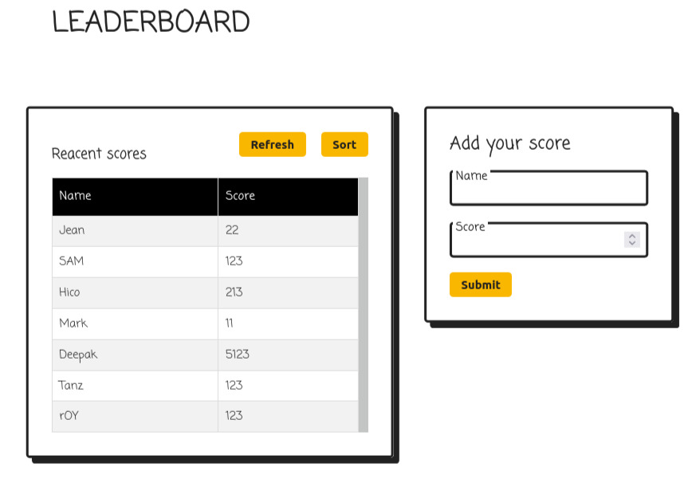

# LeaderboardJs

> Milestone 1 : Set up a JavaScript project for the Leaderboard list app, using webpack and ES6 features.

> Milestone 2 : Sending and receiving data from/to the Leaderboard API.

## Built With

- Html and Css
- JavaScript

## Live Demo

[Live Demo Link](https://od-c0d3r.github.io/LeaderboardJs/dist/)

## Getting Started

To get a local copy up and running follow these simple example steps

 - from your terminal enter in sequence 
   - `git clone https://github.com/od-c0d3r/LeaderboardJs.git`
   - `code LeaderboardJs`
   - `npm i`
   - `npm start`

## Authors

👤 **Omar R.**

- GitHub: [@od-c0d3r](https://github.com/od-c0d3r)
- Twitter: [@od-coder](https://twitter.com/od-coder)
- LinkedIn: [omarrashad](https://linkedin.com/in/omarrashad)

## 🤝 Contributing

Contributions, issues, and feature requests are welcome!

Feel free to check the [issues page](../../issues/).

## Show your support

Give a ⭐️ if you like this project!

## Acknowledge

 - Thanks to Wogan from [stackoverflow](https://stackoverflow.com/questions/1129216/sort-array-of-objects-by-string-property-value#:~:text=it's%20easy%20enough%20to%20write%20your%20own%20comparison%20function%3A) on how to sort Array of objects bassed on a property.

## 📝 License

This project is [MIT](./doc/MIT.md) licensed.
